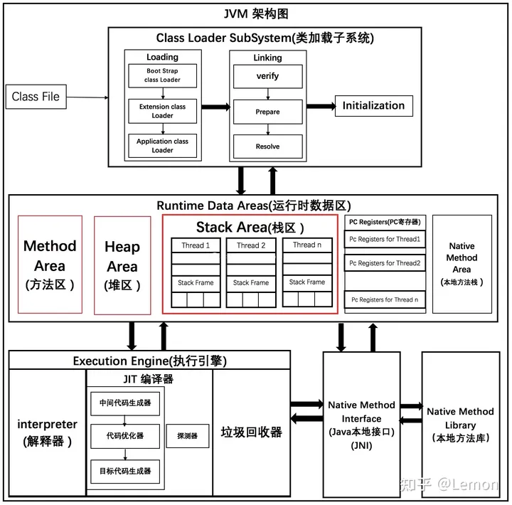
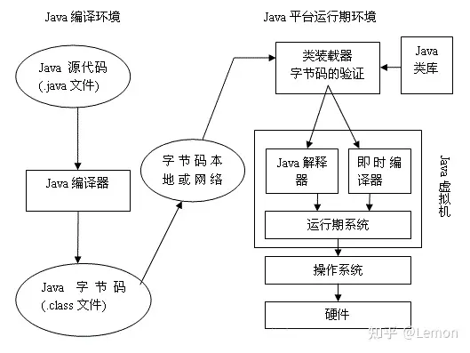

- JVM

  Java虚拟机，提供了class文件的运行支持

- JRE

  Java运行环境（Java Runtime Environment）它包括Java虚拟机（jvm）、Java核心类库和支持文件

  （用于编译程序的javac命令、用于启动JVM运行Java程序的Java命令、用于生成文档的Javadoc命令、用于打包的jar命令等

- JDK

  Java开发工具包，包含编写Java程序锁必须的编译、运行等开发工具和JRE

## 组成结构

JVM由类加载器、运行时数据区、执行引擎、本地接口、本地库组成

- 类加载器

  在JVM启动时或者类运行时将需要的class文件加载到JVM中

- 运行时数据区（内存）

  存储运行时的各种数据；将内存划分为若干个区以模拟实际机器上的存储、记录、调度等功能，如实际机器上的各种功能寄存器或者PC指针的记录器等。

- 执行引擎

  负责执行class文件中包含的字节码指令，类似于CPU

- 本地接口 & 本地库

  调用使用C或C++实现的接口

## 类加载过程

解释执行：将class文件一行一行翻译成机器码进行，并交由操作系统执行。优点是可以跨平台（这正是Java的优点），缺点是解析需要时间，执行效率低。

编译执行：将class文件全部编译成机器码文件，然后交由操作系统执行，此时操作系统可以直接执行。但是机器码文件不保存。优点是执行速度快、效率超高、占用内存小，缺点是不能跨平台。

即时编译执行：将class文件编译成机器码文件，并存入内存，以便后续使用

通过判断代码是否是热点代码来进行不同的处理的，如果是热点代码，则使用即时编译器边编译边执行，如果非热点代码，则使用解释器进行处理；程序中的代码只有是热点代码时，才会被编译为本地代码。热点代码有两类：被多次调用的代码和被多次执行的循环体

**热点探测**

1、基于采样的

　　　采用这种探测方式的虚拟机会周期性的检查各个线程的栈顶，如果发现某些方法经常出现在栈顶，那这个方法就是热点方法。这种探测方法的好处是简单有效，可以很方便的获取方法的调用关系（将调用堆栈展开即可）；缺点是不够精确，很容易受到线程阻塞或者其他外界因素的影响

2、基于计数器的

　　　采用这种探测方式的虚拟机会为每个方法甚至代码块建立一个计数器，方法每次被调用，计数器就会加一，如果调用次数达到了阈值，就认为该方法为热点方法。这种探测方法的优点是足够准确；缺点是实现比较复杂，且拿不到方法的调用关系