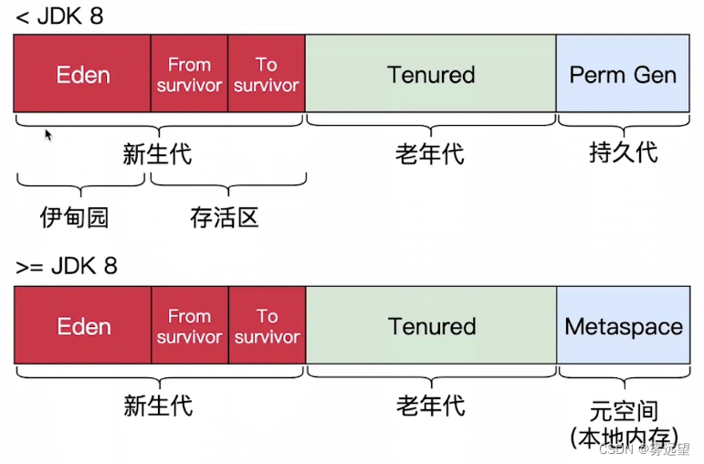

## JDK1.8之前

| 线程私有                         | 线程共享                  |
| -------------------------------- | ------------------------- |
| 虚拟机栈、本地方法栈、程序计数器 | method Area方法区、堆内存 |

## JDK1.8以后

| 线程私有                         | 线程共享                |
| -------------------------------- | ----------------------- |
| 虚拟机栈、本地方法栈、程序计数器 | metaSpace元空间、堆内存 |

- 程序计数器

  存放下一条指令所在单元的地址的地方，随着线程的创建而创建，随着线程的结束而消亡，保证 当前线程的正确执行位置

- 虚拟机栈

  由许多栈帧组成，而每个栈帧又包括了局部变量表、操作数栈、动态链接以及方法出口信息

- 本地方法栈

   native关键字修饰的方法被称为本地方法

- 元空间

   元空间是用于存放类信息、常量、静态变量、JIT即时编译器编译后的机器代码等数据

- 堆内存

  堆区是JVM所管理的内存中最大的一块区域，该区域被所有线程共享，堆区用于存放了大部分对象实例

  