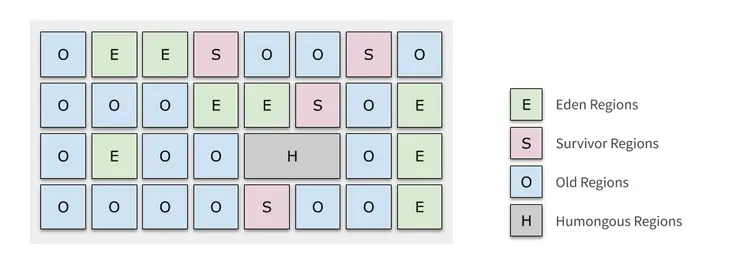

## G1垃圾回收器



G1将堆划分为2048个左右的Region内存块，每个Region大小在1-32MB之间，具体多大取决于堆的大小。G1除了普通收集器的Eden，Survivor，Old区外还额外加了Humongous这个区域，Humongous的作用是存放大对象（大对象的判断方式是大于Region的50%），Humongous跟随老年代Full GC清理。

在一个region中可能会引入到其他的region，为了避免不需要的全局扫描，在每个region中都对应一个Remembered Set（记忆集），使用CarTable记录每个region区相互引用的关系。维护解决多个区间引用关系记录，避免扫描所有的区间。 

　　

### G1收集器回收过程：

　　1）年轻代GC（Young GC ）
　　　　当所有eden区满的情况下，采用并行多线程的方式，使用标记复制算法，基于stw暂定所有用户线程，将存活对象复制到S区，清空所有eden区；当S区对象的年龄达到阈值，使用标记复制算法，将对象移动到老年代。

　　2）混合回收（Mixed GC ）
　　　　越来越多的对象晋升到老年代，当堆内存使用达到一定值（（-XX:InitiatingHeapOccupancyPercent 默认45%）时，开始老年代并发标记过程，标记完成马上开始混合回收过程。为了避免堆内存耗尽，会触发混合收集器，即Mixed GC。

        young gc（新生代） 一> young gc + concurrent mark（新生代+并发标记） 一> Mixed GC（混合回收）顺序，进行垃圾回收


## G1日志分析

设置 GC 日志的 JVM 参数 `-XX:+PrintGCDetails -XX:+PrintGCDateStamps -XX:+PrintHeapAtGC`

### YoungGC日志

```
2021-03-27T21:07:37.834+0000: 42873.305: [GC pause (G1 Evacuation Pause) (young) (initial-mark), 0.0330341 secs]   
// G1 仅暂停清理（年轻）区域。 暂停在 JVM 启动后 2021-03-27T21:07:37.834 毫秒开始，暂停持续时间以挂钟时间测量为 0.0330341 秒。
   [Parallel Time: 27.8 ms, GC Workers: 2]
   // 实际耗时 27.8 毫秒，下列活动由 2 个线程并行执行
      [GC Worker Start (ms): Min: 42873306.2, Avg: 42873306.2, Max: 42873306.2, Diff: 0.0]
      [Ext Root Scanning (ms): Min: 14.3, Avg: 19.2, Max: 24.2, Diff: 10.0, Sum: 38.5]
      [Update RS (ms): Min: 0.0, Avg: 1.6, Max: 3.2, Diff: 3.2, Sum: 3.2]
         [Processed Buffers: Min: 0, Avg: 16.0, Max: 32, Diff: 32, Sum: 32]
      [Scan RS (ms): Min: 0.0, Avg: 0.0, Max: 0.0, Diff: 0.0, Sum: 0.0]
      [Code Root Scanning (ms): Min: 0.0, Avg: 0.4, Max: 0.8, Diff: 0.8, Sum: 0.8]
      [Object Copy (ms): Min: 2.6, Avg: 5.5, Max: 8.5, Diff: 5.9, Sum: 11.0]
      [Termination (ms): Min: 0.0, Avg: 0.0, Max: 0.0, Diff: 0.0, Sum: 0.0]
         [Termination Attempts: Min: 1, Avg: 1.0, Max: 1, Diff: 0, Sum: 2]
      [GC Worker Other (ms): Min: 0.0, Avg: 0.0, Max: 0.0, Diff: 0.0, Sum: 0.0]
      [GC Worker Total (ms): Min: 26.8, Avg: 26.8, Max: 26.8, Diff: 0.0, Sum: 53.6]
      [GC Worker End (ms): Min: 42873333.0, Avg: 42873333.0, Max: 42873333.0, Diff: 0.0]
   [Code Root Fixup: 0.1 ms]
   // 按照顺序进行释放用于管理并行活动的数据结构，耗时 0.1 ms。
   [Code Root Purge: 0.0 ms]
   // 按照顺序进行清理更多的数据结构，耗时 0 ms
   [Clear CT: 0.1 ms]
   [Other: 5.0 ms]
      [Choose CSet: 0.0 ms]
      [Ref Proc: 4.5 ms]
      [Ref Enq: 0.0 ms]
      [Redirty Cards: 0.1 ms]
      [Humongous Register: 0.1 ms]
      [Humongous Reclaim: 0.0 ms]
      [Free CSet: 0.1 ms]
   [Eden: 62.0M(62.0M)->0.0B(61.0M) Survivors: 8192.0K->9216.0K Heap: 1258.0M(1408.0M)->1209.7M(1408.0M)]
 [Times: user=0.06 sys=0.00, real=0.03 secs] 
  // Eden 、Survivors 和 Heap 总内存的暂停前后使用量和容量
2021-03-27T21:07:37.868+0000: 42873.338: [GC concurrent-root-region-scan-start]
2021-03-27T21:07:37.876+0000: 42873.347: [GC concurrent-root-region-scan-end, 0.0083426 secs]
// GCRoots 扫描阶段
2021-03-27T21:07:37.876+0000: 42873.347: [GC concurrent-mark-start]
2021-03-27T21:07:38.254+0000: 42873.725: [GC concurrent-mark-end, 0.3780598 secs]
// GC 标记阶段
2021-03-27T21:07:38.254+0000: 42873.725: [GC remark 2021-03-27T21:07:38.254+0000: 42873.725: [Finalize Marking, 0.0001809 secs] 2021-03-27T21:07:38.254+0000: 42873.725: [GC ref-proc, 0.0087798 secs] 2021-03-27T21:07:38.263+0000: 42873.734: [Unloading, 0.1158455 secs], 0.1294324 secs]
 [Times: user=0.17 sys=0.00, real=0.13 secs] 
// stop the word，G1 会短暂停止应用程序线程以停止并发更新日志的流入并处理剩余的少量日志，并标记在启动并发标记周期时仍处于活动状态的任何未标记对象
2021-03-27T21:07:38.384+0000: 42873.855: [GC cleanup 1247M->1243M(1408M), 0.0010662 secs]
 [Times: user=0.00 sys=0.00, real=0.00 secs] 
2021-03-27T21:07:38.385+0000: 42873.856: [GC concurrent-cleanup-start]
2021-03-27T21:07:38.385+0000: 42873.856: [GC concurrent-cleanup-end, 0.0000160 secs]
// 内存回收
```

```
2021-03-18T07:08:23.683+0000: 13004.683: [GC pause (G1 Humongous Allocation) (young) , 0.0255329 secs]
// 巨型对象 young GC
   [Parallel Time: 21.5 ms, GC Workers: 1]    // 并行8个线程，耗时21.5ms
      [GC Worker Start (ms):  13004683.5]
      [Ext Root Scanning (ms):  14.3]   // 扫描 root 的线程耗时
      [Update RS (ms):  1.6]
         [Processed Buffers:  40]   // Processed Buffers就是记录引用变化的缓存空间
      [Scan RS (ms):  0.2]   // 扫描 RS
      [Code Root Scanning (ms):  0.2]   // 根扫描耗时
      [Object Copy (ms):  4.7]   // 对象拷贝
      [Termination (ms):  0.0]
         [Termination Attempts:  1]
      [GC Worker Other (ms):  0.0]
      [GC Worker Total (ms):  21.0]   // GC 线程耗时
      [GC Worker End (ms):  13004704.5]
   [Code Root Fixup: 0.0 ms]
   [Code Root Purge: 0.0 ms]
   [Clear CT: 0.2 ms]   // 清空 CardTable 耗时，RS 是依赖 CardTable 记录区域存活对象的
   [Other: 3.9 ms]
      [Choose CSet: 0.0 ms]   // 选取 CSet
      [Ref Proc: 3.2 ms]   // 弱引用、软引用的处理耗时
      [Ref Enq: 0.0 ms]   // 弱引用、软引用的入队耗时
      [Redirty Cards: 0.1 ms]
      [Humongous Register: 0.1 ms]
      [Humongous Reclaim: 0.0 ms]
      [Free CSet: 0.2 ms]    // 释放被回收区域的耗时
   [Eden: 373.0M(395.0M)->0.0B(380.0M) Survivors: 1024.0K->14.0M Heap: 1189.9M(1408.0M)->830.5M(1408.0M)]   // 显示了堆的大小变化, Eden 从 373.0M 下降到 0, Survivors 从 1024.0K 上升到 14.0M，Heap 内存从 1189.9M 下降到  830.5M
 [Times: user=0.03 sys=0.00, real=0.03 secs] 
2021-03-18T07:08:23.708+0000: 13004.709: [GC concurrent-root-region-scan-start]   // 根区域扫描
2021-03-18T07:08:23.713+0000: 13004.713: [GC concurrent-root-region-scan-end, 0.0048903 secs]   
2021-03-18T07:08:23.713+0000: 13004.713: [GC concurrent-mark-start]    // 并发标记
2021-03-18T07:08:23.872+0000: 13004.872: [GC concurrent-mark-end, 0.1585816 secs] 
2021-03-18T07:08:23.933+0000: 13004.933: [GC remark 2021-03-18T07:08:23.933+0000: 13004.933: [Finalize Marking, 0.0002291 secs] 2021-03-18T07:08:23.933+0000: 13004.934: [GC ref-proc, 0.0080423 secs] 2021-03-18T07:08:23.941+0000: 13004.942: [Unloading, 0.0703731 secs], 0.0852099 secs]
 [Times: user=0.09 sys=0.00, real=0.09 secs] 
2021-03-18T07:08:24.019+0000: 13005.019: [GC cleanup 851M->764M(1408M), 0.0027544 secs]
 [Times: user=0.00 sys=0.00, real=0.00 secs] 
2021-03-18T07:08:24.022+0000: 13005.022: [GC concurrent-cleanup-start]   // 重新标记又叫最终标记
2021-03-18T07:08:24.022+0000: 13005.022: [GC concurrent-cleanup-end, 0.0000804 secs]
```

### 混合 mixed GC 日志

```
2021-03-18T07:03:33.457+0000: 12714.458: [GC pause (G1 Evacuation Pause) (mixed), 0.1126267 secs]   // mixed GC 
   [Parallel Time: 110.7 ms, GC Workers: 1]
      [GC Worker Start (ms):  12714457.7]
      [Ext Root Scanning (ms):  12.9]
      [Update RS (ms):  68.6]
         [Processed Buffers:  107]
      [Scan RS (ms):  0.2]
      [Code Root Scanning (ms):  6.0]
      [Object Copy (ms):  22.8]
      [Termination (ms):  0.0]
         [Termination Attempts:  1]
      [GC Worker Other (ms):  0.0]
      [GC Worker Total (ms):  110.7]
      [GC Worker End (ms):  12714568.4]
   [Code Root Fixup: 0.5 ms]
   [Code Root Purge: 0.0 ms]
   [Clear CT: 0.1 ms]
   [Other: 1.3 ms]
      [Choose CSet: 0.0 ms]
      [Ref Proc: 0.5 ms]
      [Ref Enq: 0.0 ms]
      [Redirty Cards: 0.1 ms]
      [Humongous Register: 0.1 ms]
      [Humongous Reclaim: 0.0 ms]
      [Free CSet: 0.4 ms]
   [Eden: 37.0M(37.0M)->0.0B(69.0M) Survivors: 33.0M->1024.0K Heap: 982.0M(1408.0M)->904.5M(1408.0M)]
 [Times: user=0.07 sys=0.00, real=0.11 secs]
```

### 老年代 Full GC 日志

```
2021-03-19T02:08:52.178+0000: 81433.178: [Full GC (Allocation Failure)  1331M->1190M(1408M), 0.3951381 secs]   // Full GC 失败, 其原因是空间分配失败(Allocation Failure)
   [Eden: 0.0B(68.0M)->0.0B(70.0M) Survivors: 2048.0K->0.0B Heap: 1331.5M(1408.0M)->1190.0M(1408.0M)], [Metaspace: 595088K->593735K(1597440K)]   // 显示了堆的大小变化
 [Times: user=0.40 sys=0.00, real=0.39 secs]    // 表示 GC 总共花了 0.39 秒
```

