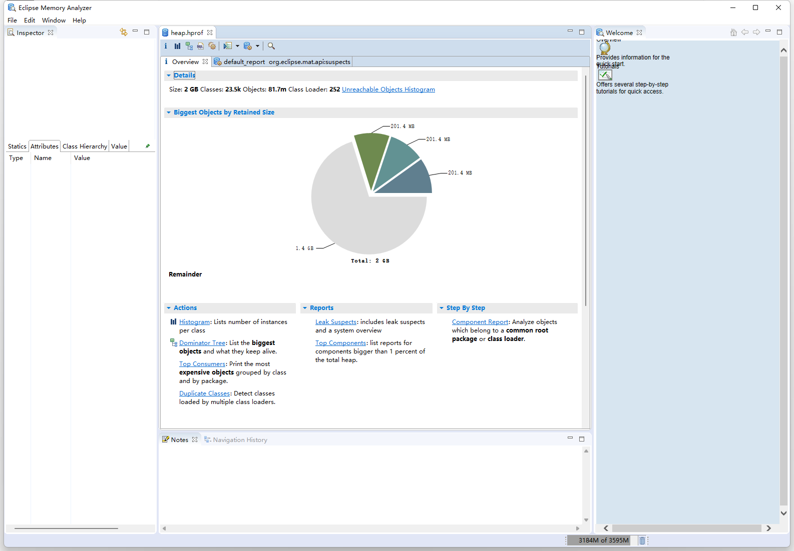

## 内存分析工具

echo $JAVA_HOME

切换到 JDK_HOME/bin/，

执行以下命令： jmap -dump:format=b,file=/tmp/heap.hprof  pid

内存分析工具：

eclipse Memory Analyzer (MAT)

下载地址：https://eclipse.dev/mat/previousReleases.php

## MAT使用

- Histogram: 可以列出内存中的对象，对象的个数以及大小
- Dominator Tree: 可以列出那个线程，以及线程下面的那些对象占用的空间
- Top Consumers
- Leak Suspects

