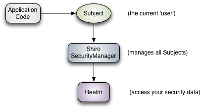
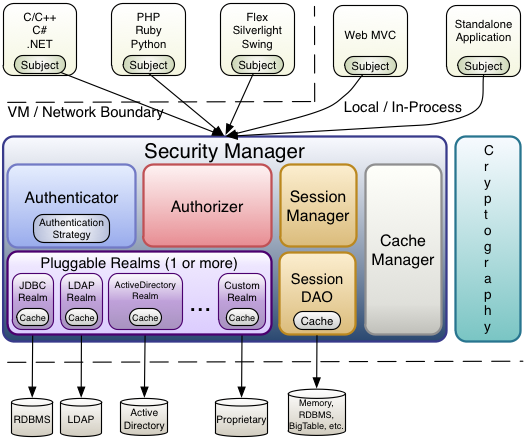

| 参考文档 | https://shiro.apache.org/architecture.html |
| -------- | ------------------------------------------ |

## 组成概念

- subject

  主题对象。本质上是当前执行用户的安全特定“视图”。Subject`实例都绑定到(并且需要)一个`SecurityManager`。当你和一个`Subject`，这些交互转化为特定于主题的交互`SecurityManager

- securityManager

  安全管理。是Shiro架构的核心，充当一种“保护伞”对象，协调其内部安全组件，共同形成一个对象图。然而，一旦为应用程序配置了SecurityManager及其内部对象图，通常就不管它了，应用程序开发人员几乎把所有的时间都花在`Subject`API

- realm

  领域。Shiro和应用程序安全数据之间的“桥梁”或“连接器”。当需要与安全相关的数据(如用户帐户)进行实际交互以执行身份验证(登录)和授权(访问控制)时，Shiro会从为应用程序配置的一个或多个领域中查找许多这样的东西。

## 核心架构

- **Authenticator** 
- **Authorizer** 
- **SessionManager** 
- **CacheManager** 
- **Cryptography** 
- **Realms** 