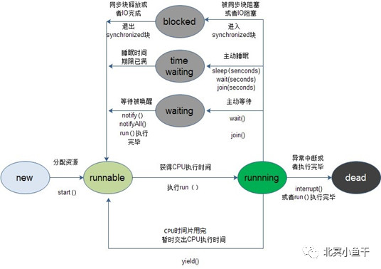
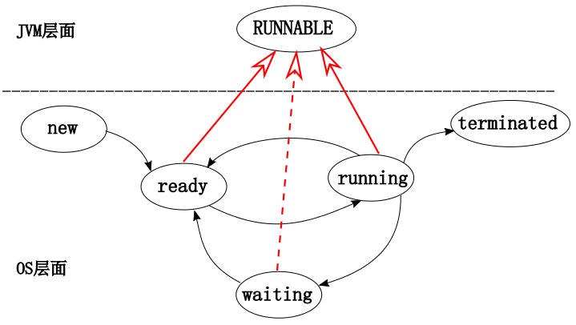

# 什么是线程？

CPU调度执行的基本单位。对于java程序，当jvm至少会提供一个线程负责来执行（称为主线程），除了主线程之外，jvm启动的不止一个线程，比如负责垃圾回收机制的线程。

# JAVA如何创建线程？

1. **将类申明位Thread的子类，重写Thread 类的run方法（即通过继承Thread方式）**

   ```
   public class MyThread extends Thread {
       @Override
       public void run() {
           System.out.println("自定义线程");
       }
    
    MyThread thread = new MyThread();
    thread.start();
   ```

2. **实现Runnable接口，以及对应run()方法**

   ```
   public class MyThread implements Runnable {
   	@Override
   	public void run(){
   	 System.out.println("线程");
   	}
   }
   ```

3. **实现Callable<V>** **接口，以及对应的call()** **方法**

   ```
   public class MyThread implements Callable<String> {
   	Computes a result, or throws an exception if unable to do so.
   	@Override
   	public String call() throws Exception {
    	 	return "do some thing";
   	}
   }
   
   FutureTask<String> futureTask = new FutureTask<>(new MyThread());
   new Thread(futureTask).start();
   
   //可以通过获取线程执行结果，注意：get方法是阻塞的，即：线程无返回结果，get方法会一直等待
   futureTask.get();
   ```


# 线程的生命周期

线程状态（java.lang.Thread.State ）

- **NEW 新建状态**

  尚未启动的线程处于此状态。即创建Thread对象，未执行start()方法。

- **RUNNABLE 就绪状态**

  Java 虚拟机中执行的线程处于此状态。即执行了start()方法，等待获取系统资源（如CPU资源）。

- **BLOCKED 阻塞状态**

  阻塞等待监视器锁的线程处于这种状态。当前线程正在等待锁资源。

- **WAITING 等待状态**

  一个线程无限期地等待另一个线程，执行特定操作时处于此状态。当前线程需要被唤醒，才能执行。

- **TIMED_WAITING 等待超时状态**

  等待另一个线程执行操作的线程长达指定的等待时间处于此状态。与WAITING相比，超时之后该线程会被自动唤醒。

- **TERMNATED 终止状态**

  已退出的线程处于此状态。该线程不能被转换未其他状态。

注：一个线程在给定的时间点只能处于一种状态。这些状态是JAVA虚拟机状态，不反映任何操作系统线程状态。




# 操作系统线程与Java线程关系

**问题1：为啥java线程状态无Runing？** 

现代操作系统的cpu通常都是用所谓的“时间分片(time quantum or time slice)”方式进行抢占式(preemptive)轮转调度(round-robin式)。

更复杂的可能还会加入优先级(priority)的机制。

这个时间分片通常是很小的，一个线程一次最多只能在 cpu 上运行比如10-20ms 的时间(此时处于 running 状态)，也即大概只有0.01秒这一量级，时间片用后就要被切换下来放入调度队列的末尾等待再次调度 (也即回到 ready 状态)。JVM 本身没有做什么实质的调度，把底层的 ready 及 running 状态映射上来也没多大意义。




注意：**RUNNABLE 状态对应了传统OS线程的 ready， running 以及部分的 waiting 状态。**


**问题2：java线程如何进入BLOCKED 阻塞状态  和 WAITING 等待状态？**

Java 线程状态的改变通常只与自身显式引入的机制有关，如果 JVM 中的线程状态发生改变了，通常是自身机制引发的。比如 synchronize 机制有可能让线程进入BLOCKED 状态，sleep，wait等方法则可能让其进入 WATING 之类的状态。

