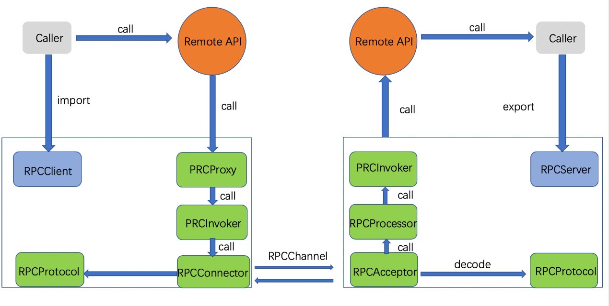
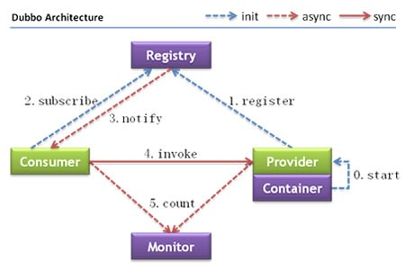

| 官方文档 | http://dubbo.apache.org/zh-cn/ |
| -------- | ------------------------------ |
| 版本号   | 2.7.4                          |

## 背景

- **单一应用架构**

  当我们服务访问量较小时，只需一个应用包含所有功能，这样可以减少服务部署节点成本。

- **垂直应用架构**

  随着访问量的逐步增加，单一应用的性能并不能满足我们，此时就需拆分为多个应用（如mvc框架）。

- **分布式服务架构**

  当垂直应用越来越多，各个应用的交互不可避免，把核心业务抽离为单独服务，逐步形成稳定的服务中心，以适应前端快速需求变化。此时为了提高服务的复用以及整合，就需要分布式服务RPC框架。

## RPC框架

**Remote Procedure Call 远程过程调用**。 

简单的说：就是让服务消费方可以像本地方法调用一样，来调用远程服务方的服务。



## dubbo 是什么？

Dubbo是一款高性能、轻量级的开源Java RPC框架



**由以下几个模块构成：**

- Provider：暴露服务的服务提供方
- Consumer：调用远程服务的消费方
- Registry：服务注册与发现的注册中心
- Monitor： 统计服务的调用次数和调用时间的监控中心
- Container：服务运行容器

**模块关系说明：**

1. 服务容器负责启动，加载，运行服务提供者
2. 服务提供者在启动时，向注册中心注册自己提供的服务。
3. 服务消费者在启动时，向注册中心订阅自己所需的服务。
4. 注册中心返回服务提供者地址列表给消费者，如果有变更，注册中心将基于长连接推送变更数据给消费者。
5. 服务消费者，从提供者地址列表中，基于软负载均衡算法，选一台提供者进行调用，如果调用失败，再选另一台调用。
6. 服务消费者和提供者，在内存中累计调用次数和调用时间，定时每分钟发送一次统计数据到监控中心。

dubbo 能做什么？

它提供了三大核心能力：

- [x] **面向接口的远程方法调用**

  透明化的远程方法调用，就像调用本地方法一样调用远程方法，只需简单配置，没有任何API侵入

- [x] **智能容错和负载均衡**

  软负载均衡及容错机制，可在内网替代F5等硬件负载均衡器，降低成本，减少单点。

- [x] **服务自动注册和发现**

  不再需要写死服务提供方地址，注册中心基于接口名查询服务提供者的IP地址，并且能够平滑添加或删除服务提供者。

## dubbo 核心原理
1. **服务的导出**

   ```
   服务导出过程：开始于spring容器的刷新事件，dubbo在接收到事件之后，会立即执行服务导出逻辑，
   大致逻辑步骤如下：
       >  前置工作，检查参数，组装url
       >  导出服务，导出服务到本地（jvm），导出服务到远程
       >  注册服务，向注册中心注册服务，用于服务发现
       
   服务的延时暴露：如果你的服务需要预热时间，比如初始化缓存，等待相关资源就位等，可以使用 delay 进行延迟暴露
   Dubbo-2.6.5之前版本
   	（1）延迟到 Spring 初始化完成后，再暴露服务 <dubbo:service delay="-1" />
       （2）延迟 5 秒暴露服务 <dubbo:service delay="5000" /> 
   Dubbo-2.6.5及其之后版本
   所有服务都将在 Spring 初始化完成后进行暴露，如果你不需要延迟暴露服务，无需配置 delay
   <dubbo:service delay="5000" /> 表示spring初始化完成之后开始延时
   ```

2. **服务的引入**

   ```
   Dubbo服务的引用分两种：
       >  第一种是使用服务直连的方式引用服务（联调测试环境）
       >  第二种是通过注册中心进行引用
   Dubbo服务的引用时机分两种：
       >  第一个是在 Spring 容器调用 ReferenceBean 的 afterPropertiesSet 方法时引用服务
       >  第二个是在 ReferenceBean 对应的服务被注入到其他类中时引用
   ```

3. **服务目录**

   ```
   定义：服务目录中存储了一些和服务提供者有关的信息，通过服务目录，服务消费者可获取到服务提供者的信息，
   比如 ip、端口、服务协议等。通过这些信息，服务消费者就可通过 Netty 等客户端进行远程调用。
   
   结构：实际上服务目录在获取注册中心的服务配置信息后，会为每条配置信息生成一个 Invoker 对象，
         并把这个 Invoker 对象存储起来，这个 Invoker 才是服务目录最终持有的对象
         它可以看做是 Invoker 集合，且这个集合中的元素会随注册中心的变化而进行动态调整。
   --> Invoker： 具有远程调用功能的对象
   ```

4. **服务路由**

   ```
   服务路由包含一条路由规则，路由规则决定了服务消费者的调用目标，即规定了服务消费者可调用哪些服务提供者。
   • 条件路由 ConditionRouter
   • 脚本路由 ScriptRouter 
   • 标签路由 TagRouter
   ```

5. **负载均衡**

   ```
   • 权重随机算法的 RandomLoadBalance
       现在把这些权重值平铺在一维坐标值上，[0, 5) 区间属于服务器 A，[5, 8) 区间属于服务器 B，[8, 10) 区间属于服务器 C。
       接下来通过随机数生成器生成一个范围在 [0, 10) 之间的随机数，然后计算这个随机数会落到哪个区间上。
       
   • 最少活跃调用数算法的 LeastActiveLoadBalance
   • 基于 hash 一致性的 ConsistentHashLoadBalance
   • 基于加权轮询算法的 RoundRobinLoadBalance
   ```

 

##  dubbo-spi
SPI 全称为 Service Provider Interface（服务发现机制）。

SPI 的本质是将接口实现类的全限定名配置在文件中，并由服务加载器读取配置文件，加载实现类。这样可以在运行时，动态为接口替换实现类，通过 SPI 机制为我们的程序提供拓展功能。

**dubbo-spi** 

        1. 配置文件需放置在 META-INF/dubbo 路径下（键值对的方式进行配置，如：bumblebee = org.apache.spi.Bumblebee）
                2. 接口上 @SPI 注解
        Dubbo SPI 除了支持按需加载接口实现类，还增加了 IOC 和 AOP 等特性    


## dubbo注册中心：

https://cn.dubbo.apache.org/zh-cn/overview/mannual/java-sdk/reference-manual/registry/nacos/

