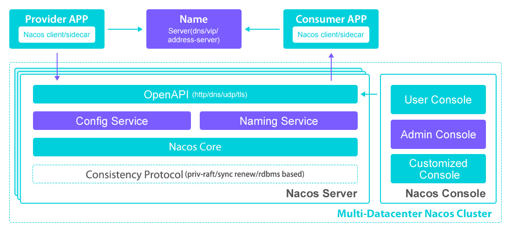

| 官网地址 | https://nacos.io/zh-cn/ |
| :------- | ----------------------- |


# 什么是nacos?

支持”服务“的发现、配置和管理。

关键特性：

- **服务发现和服务健康监测**

  （1）Nacos 支持基于 DNS 和基于 RPC 的服务发现。

  ​		  服务提供者使用原生SDK、openApi或者Agent TODO注册服务后，服务消费者可以时使用DNS TODO 或者 http&API 查找和发现服务。

  （2）Nacos 提供对服务的实时的健康检查，阻止向不健康的主机或服务实例发送请求

  ​		  Nacos 支持传输层 (PING 或 TCP)和应用层 (如 HTTP、MySQL、用户自定义）的健康检查。对于复杂的云环境或者网络拓扑环境，Nacos 提供了 agent 上报模式和服务端主动检测2种健康检查模式。

- **动态配置服务**

  ​	动态配置服务可以让您以中心化、外部化和动态化（解决配置变更，需重新部署应用和服务问题）的方式管理所有环境的应用配置和服务配置。

- **动态DNS服务**

  ​	动态 DNS 服务支持权重路由，让您更容易地实现中间层负载均衡、更灵活的路由策略、流量控制以及数据中心内网的简单DNS解析服务。

- **服务及其元数据管理**

  ​	Nacos 能让您从微服务平台建设的视角管理数据中心的所有服务及元数据，包括管理服务的描述、生命周期、服务的静态依赖分析、服务的健康状态、服务的流量管理、路由及安全策略、服务的 SLA 以及最首要的 metrics 统计数据。


# 基本架构及概念



- **服务元数据**

  包括服务端点(endpoints)、服务标签、服务版本号、服务实例权重、路由规则、安全策略等描述服务的数据。

- **服务提供方**

- **服务消费方**

- **服务注册中心**

  它是服务，其实例及元数据的数据库。服务实例在启动时注册到服务注册表，并在关闭时注销。服务和路由器的客户端查询服务注册表以查找服务的可用实例。服务注册中心可能会调用服务实例的健康检查 API 来验证它是否能够处理请求。

- **配置管理**

  在数据中心中，系统中所有配置的编辑、存储、分发、变更管理、历史版本管理、变更审计等所有与配置相关的活动统称为配置管理。


# 快速开始

- **windows命令**

```
#启动
startup.cmd -m standalone
#关闭
shutdown.cmd
```

```
Linux 命令
#启动(standalone代表着单机模式运行，非集群模式)
sh startup.sh -m standalone
#关闭
sh shutdown.sh
```

