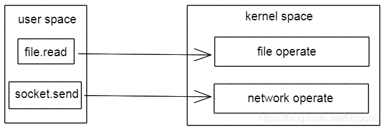

# 基本概念

- **内核空间** **（kernel space）**

  操作系统进程占据的内存区域，如文件读写、网络传输、进程和线程管理、调用系统资源等。

- **用户空间** **（user space）**

  用户进程所在的内存区域，如应用程序

对 32 位操作系统而言，它的寻址空间（虚拟地址空间，或叫线性地址空间）为 4G（2的32次方），也就是说一个进程的最大地址空间为 4G。具体的实现方式基本都是由操作系统将虚拟地址空间划分为两部分，一部分为内核空间，另一部分为用户空间。针对 Linux 操作系统而言，最高的 1G 字节(从虚拟地址 0xC0000000 到 0xFFFFFFFF)由内核使用，称为内核空间。而较低的 3G 字节(从虚拟地址 0x00000000 到 0xBFFFFFFF)由各个进程使用，称为用户空间。

# 划分空间的目的

保证系统的安全和稳定。

**原因**：

在 CPU 的所有指令中，有些指令是非常危险的，如果错用，将导致系统崩溃，比如清内存、设置时钟等。如果允许所有的程序都可以使用这些指令，那么系统崩溃的概率将大大增加。

所以，CPU 将指令分为特权指令和非特权指令，对于那些危险的指令，只允许操作系统及其相关模块使用，普通应用程序只能使用那些不会造成灾难的指令。比如 Intel 的 CPU 将特权等级分为 4 个级别：Ring0~Ring3。
其实 Linux 系统只使用了 Ring0 和 Ring3 两个运行级别(Windows 系统也是一样的)。当进程运行在 Ring3 级别时被称为运行在用户态，而运行在 Ring0 级别时被称为运行在内核态。

# 如何从用户空间进入内核空间

为了保证用户程序崩溃等不影响内核，用户空间和内核空间是隔离的。

所有的系统资源管理都是在内核空间中完成的。比如读写磁盘文件，分配回收内存，从网络接口读写数据等等。我们的应用程序是无法直接进行这样的操作。用户空间只能执行简单的运算，很多时候，还需要调用内核空间。如应用程序要读取某个文件时，并不是直接去读取文件，而是通过调用内核程序（也称 system call），内核读取文件后，再返回给应用程序