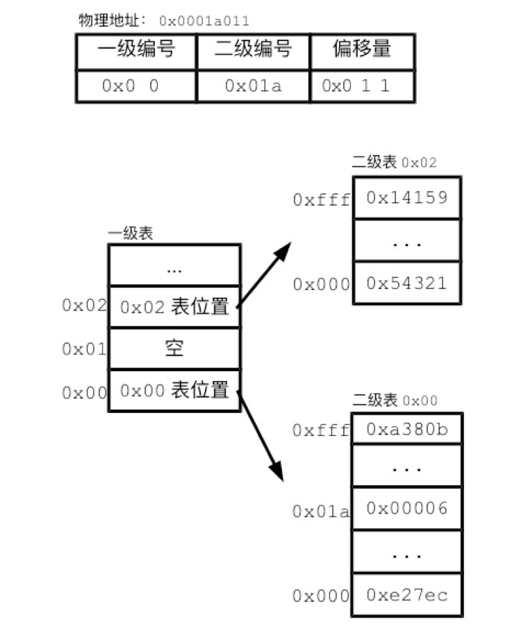

# 内存

​	内存简单的说就是一个数据货架，内存的最小存储单位大多数是一个字节。内存使用内存地址来为每个字节单元的数据编号。以32位的机器为例，内存地址从0开始，每次增加1，用16进制表示32位地址空间就是从0x00000000 到0xFFFFFFFF。

# 虚拟内存

​	内存的一项主要任务，就是存储进程的相关数据。比如进程空间的程序段、全局数据、栈和堆，以及这些这些存储结构在进程运行中所起到的关键作用。有趣的是，尽管进程和内存的关系如此紧密，但进程并不能直接访问内存。在Linux下，进程不能直接读写内存中地址为0x1位置的数据。进程中能访问的地址，只能是虚拟内存地址（virtual memory address）。操作系统会把虚拟内存地址翻译成真实的内存地址。这种内存管理方式，称为虚拟内（virtual memory）。

## 为啥不能直接访问内存，要建立虚拟内存

问题1：进程地址空间不隔离。由于程序都是直接访问物理内存，恶意程序可以修改别的进程内存数据。

问题2：内存使用率低。

问题3：因为内存时随机分配的，程序运行地址不确定。

解决方案：

- **分段（Sagmentation）处理**

  将物理地址空间一段映射到虚拟地址空间，比如把10M大小的物理空间地址映射到10M的虚拟地址空间。分段的映射方法中，每次换入换出内存的都是整个程序， 这样会造成大量的磁盘访问操作，导致效率低下。所以这种映射方法还是稍显粗糙，粒度比较大。

- **分页（Paging）处理**

  将地址空间分成许多的页，建立物理页和虚拟页关系。每页的大小由 CPU 决定，然后由操作系统选择页的大小。目前 Inter 系列的 CPU 支持 4KB 大小。


# 内存分页

虚拟内存地址和物理内存地址的分离，给进程带来便利性和安全性。但虚拟内存地址和物理内存地址的翻译，又会额外耗费计算机资源。在多任务的现代计算机中，虚拟内存地址已经成为必备的设计。那么，操作系统必须要考虑清楚，如何能高效地翻译虚拟内存地址。

​	记录对应关系最简单的办法，就是把对应关系记录在一张表中，为了让翻译速度足够地快，这个表必须加载在内存中。不过，这种记录方式惊人地浪费内存空间。Linux采用了分页（paging）的方式来记录对应关系。所谓的分页，就是以更大尺寸的单位页（page）来管理内存。在Linux中，通常每页大小为4KB。

查询Linux内存页大小：

```
getconf PAGE_SIZE

得到结果：4096 代表每个内存页可以存放4096个字节，即4KB
```

Linux把物理内存和进程空间都分割成页。无论是虚拟页，还是物理页，一页之内的地址都是连续的。这样的话，一个虚拟页和一个物理页对应起来，页内的数据就可以按顺序一一对应。这意味着，虚拟内存地址和物理内存地址的末尾部分应该完全相同。大多数情况下，每一页有4096个字节。由于4096是2的12次方，所以地址最后12位的对应关系天然成立。我们把地址的这一部分称为偏移量（offset）。偏移量实际上表达了该字节在页内的位置。地址的前一部分则是页编号。操作系统只需要记录页编号的对应关系。


# 多级分页表

内存分页制度的关键，在于管理进程空间页和物理页的对应关系。操作系统把对应关系记录在分页表（page table）中。这种对应关系让上层的抽象内存和下层的物理内存分离，从而让Linux能灵活地进行内存管理。由于每个进程会有一套虚拟内存地址，那么每个进程都会有一个分页表。为了保证查询速度，分页表也会保存在内存中。分页表有很多种实现方式，最简单的一种分页表就是把所有的对应关系记录到同一个线性列表中。

**问题：** 

这种单一的连续分页表，需要给每一个虚拟页预留一条记录的位置。但对于任何一个应用进程，其进程空间真正用到的地址都相当有限。如果使用连续分页表，很多条目都没有真正用到。因此，Linux中的分页表，采用了多层的数据结构。多层的分页表能够减少所需的空间。

