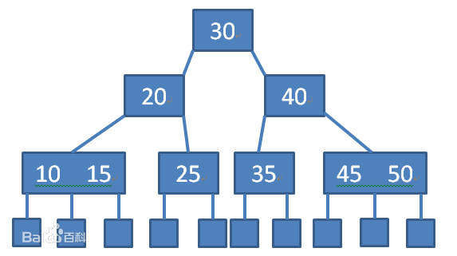

官方文档：https://dev.mysql.com/doc/
B树和B+树之间对比：https://blog.csdn.net/qq_26222859/article/details/80631121

# 数据库操作语句
    数据定义语言(DDL)：主要的命令有CREATE、ALTER、DROP等，
                       DDL主要是用在定义或改变表（TABLE）的结构，
                       数据类型，表之间的链接和约束等初始化工作上，他们大多在建立表时使用
    数据操作语言(DML)：如（SELECT、UPDATE、INSERT、DELETE）等，用来对数据库里的数据进行操作的语言。
    数据控制语言(DCL)：是用来设置或更改数据库用户或角色权限的语句，包括（grant,deny,revoke等）语句
    事务控制语言(TCL)：

# Mysql 存储引擎
    1、InnoDB
        存储文件：有两个，后缀.frm 和 .idb，其中.frm 表示定义文件， .idb是数据文件（索引+数据）。
        锁：存在行级锁和表级锁，不过行锁是命中缓存情况下才会起作用
        事务：且支持四种隔离级别（读未提交、读已提交、可重复读、串行化），默认的为可重复读；
              而在 Oracle 数据库中，只支持串行化级别和读已提交这两种级别，其中默认的为读已提交级别。
    2、Myisam
        存储文件：有三个，后缀.frm 、.MYD 和.MYI，其中.frm表示定义文件，.MYD是数据文件，,MYI是索引文件
        锁：只支持表锁，由于有单独索引文件，所以在读取数据性能很高
        事务：不支持事务
       
    3、数据结构
        InnoDB 和 Myisam 都是用B+Tree来存储数据

# Mysql 数据结构
    .二叉树排序树
        （1）若左子树不为空，则左子树所有节点的值小于它根节点的值
        （2）若右子树不为空，则右子树所有节点的值大于它根节点的值
        （3）左、右子树也分别为二叉排序树
        （4）没有键值相等的节点
     
     不适合用作数据库索引：
     (1)当数据量大的时候，树的高度会比较高，查询会比较慢；
     (2)每个节点只存储一个记录，可能导致一次查询有很多次磁盘IO；
     ---------------------------------------------------------------------------------------------------------   
        
    .B树
        一棵m阶B树(balanced tree of order m)是一棵平衡的m路搜索树。
        它或者是空树，或者是满足下列性质的树：
        1、根结点至少有两个子女
        2、每个非根节点所包含的关键字个数 j 满足：┌m/2┐ - 1 <= j <= m - 1；（┌m/2┐表示向上取整数）
        3、除根结点以外的所有结点（不包括叶子结点）的度数正好是关键字总数加1，故内部子树个数 k 满足：┌m/2┐ <= k <= m ；
        4、所有的叶子结点都位于同一层。
        
        在B-树中，每个结点中关键字从小到大排列，并且当该结点的孩子是非叶子结点时，
        该k-1个关键字正好是k个孩子包含的关键字的值域的分划。
        因为叶子结点不包含关键字，所以可以把叶子结点看成在树里实际上并不存在外部结点，指向这些外部结点的指针为空，
        叶子结点的数目正好等于树中所包含的关键字总个数加1。
        
        B-树中的一个包含n个关键字，n+1个指针的结点的一般形式为： （n,P0,K1,P1,K2,P2,…,Kn,Pn）
        其中，Ki为关键字，K1<K2<…<Kn, Pi 是指向包括Ki到Ki+1之间的关键字的子树的指针。

       
    
    .B+树
        B+树是B树的一种变形形式，B+树上的叶子结点存储关键字以及相应记录的地址，叶子结点以上各层作为索引使用
        一棵m阶的B+树定义如下:
        (1)每个结点至多有m个子女；
        (2)除根结点外，每个结点至少有[m/2]个子女，根结点至少有两个子女；
        (3)有k个子女的结点必有k个关键字
        
        B+树的查找与B树不同，当索引部分某个结点的关键字与所查的关键字相等时，
        并不停止查找，应继续沿着这个关键字左边的指针向下，一直查到该关键字所在的叶子结点为止。
        
        B+树是一种树数据结构，通常用于数据库和操作系统的文件系统中。
        B+树的特点是能够保持数据稳定有序，其插入与修改拥有较稳定的对数时间复杂度。
        B+树元素自底向上插入，这与二叉树恰好相反

# mysql 性能调优

  **执行计划命令**
    
    MySQL提供explain/desc命令输出执行计划，我们通过执行计划优化SQL语句。
    使用方法：explain/desc + sql语句
    执行计划输出内容：id、select_type、table、partitions、type、possible_keys、key、key_len、ref、rows、filtered、extra
    一、id（select 查询序列号）
       相同id -> 从上往下依次执行
       不同id -> id越大优先级越高，越先被执行
       
    二、select_type（查询语句类型）
    	(1) SIMPLE(简单SELECT,不使用UNION或子查询等)
    	(2) PRIMARY(查询中若包含任何复杂的子部分,最外层的select被标记为PRIMARY)
    	(3) UNION(UNION中的第二个或后面的SELECT语句)
    	(4) DEPENDENT UNION(UNION中的第二个或后面的SELECT语句，取决于外面的查询)
    	(5) UNION RESULT(UNION的结果)
    	(6) SUBQUERY(子查询中的第一个SELECT)
    	(7) DEPENDENT SUBQUERY(子查询中的第一个SELECT，取决于外面的查询)
    	(8) DERIVED(派生/衍生表的SELECT, FROM子句的子查询)
    	(9) MATERIALIZED(物化子查询) 在SQL执行过程中，
        	第一次需要子查询结果时执行子查询并将子查询的结果保存为临时表 ，后续对子查询结果集的访问将直接通过临时表获得。
    	(10) UNCACHEABLE SUBQUERY(一个子查询的结果不能被缓存，必须重新评估外链接的第一行)
    	(11) UNCACHEABLE UNION(UNION查询的结果不能被缓存)
    
    三、table，查询涉及的表或衍生表(若表有别名，则显示别名)
    
    四、partitions查询涉及到的分区
    
    五、“type” 提供了判断查询是否高效的重要依据依据
    	type	    说明
    	ALL	        全数据表扫描
    	index	    全索引表扫描
    	RANGE	    对索引列进行范围查找
    	INDEX_MERGE	合并索引，使用多个单列索引搜索
    	REF	        根据索引查找一个或多个值
        EQ_REF	    搜索时使用primary key 或 unique类型
    	CONST	    常量，表最多有一个匹配行,因为仅有一行,在这行的列值可被优化器剩余部分认为是常数,const表很快,因为它们只读取一					次。
    	SYSTEM	    系统，表仅有一行(=系统表)。这是const联接类型的一个特例。
    性能：all < index < range < index_merge < ref_or_null < ref < eq_ref < system/const
    性能在 range 之下基本都可以进行调优
    
    六、possible_keys：指示MySQL可以从中选择查找此表中的行的索引。
    
    七、key：MySQL查询实际使用到的索引。
    
    八、key_len：表示索引中使用的字节数（只计算利用索引作为index key的索引长度，不包括用于group by/order by的索引长度）
    	(1) 一般地，key_len 等于索引列类型字节长度，例如int类型为4 bytes，bigint为8 bytes；
    	(2) 如果是字符串类型，还需要同时考虑字符集因素，例如utf8字符集1个字符占3个字节，gbk字符集1个字符占2个字节
    	(3) 若该列类型定义时允许NULL，其key_len还需要再加 1 bytes
    	(4) 若该列类型为变长类型，例如 VARCHAR（TEXT\BLOB不允许整列创建索引，如果创建部分索引也被视为动态列类型），
        其key_len还需要再加 2 bytes
        
    九、ref：显示该表的索引字段关联了哪张表的哪个字段
    
    十、rows：根据表统计信息及选用情况，大致估算出找到所需的记录或所需读取的行数，数值越小越好
    
    十一、filtered：返回结果的行数占读取行数的百分比，值越大越好
    
    十二、extra：包含不适合在其他列中显示但十分重要的额外信息
        常见的值如下:
        (1) use filesort：MySQL会对数据使用非索引列进行排序，
            而不是按照索引顺序进行读取；若出现改值，应优化索引
        (2) use temporary：使用临时表保存中间结果，比如，MySQL在对查询结果排序时使用临时表，
            常见于order by和group by；若出现改值，应优化索引
        (3) use index：表示select操作使用了索引覆盖，避免回表访问数据行，效率不错
        (4) use where：where子句用于限制哪一行

  调优案例

    一、索引失效
     (1)多表联合查询时，关联索引字段因为字符集编码不一致，导致索引失效


**其他辅助查询命令**

```
# 查询mysql服务状态
    mysql> show global status;
# 查询mysql配置语句；
    mysql> show variables;
# 最大链接数
    mysql> show variables like 'max_connections';
    +-----------------+-------+
    | Variable_name   | Value |
    +-----------------+-------+
    | max_connections | 4532  |
    +-----------------+-------+
    mysql> show global status like 'Max_used_connections';
    +----------------------+-------+
    | Variable_name        | Value |
    +----------------------+-------+
    | Max_used_connections | 127   |
    +----------------------+-------+
# 慢查询
    mysql> show variables like '%slow%';
    +---------------------------+-------------------------------------------+
    | Variable_name             | Value                                     |
    +---------------------------+-------------------------------------------+
    | log_slow_admin_statements | OFF                                       |
    | log_slow_slave_statements | OFF                                       |
    | slow_launch_time          | 2                                         |
    | slow_query_log            | ON                                        |
    | slow_query_log_file       | /home/mysql/data3111/mysql/slow_query.log |
    +---------------------------+-------------------------------------------+
    mysql> show global status like '%slow%';
    +---------------------+--------+
    | Variable_name       | Value  |
    +---------------------+--------+
    | Slow_launch_threads | 0      |
    | Slow_queries        | 224166 |  
    +---------------------+--------+
# 进程数
    mysql>  show global status like 'Thread%';
    +-------------------+-------+
    | Variable_name     | Value |
    +-------------------+-------+
    | Threads_cached    | 86    |  //代表当前此时此刻线程缓存中有多少空闲线程
    | Threads_connected | 33    |  //代表当前已建立连接的数量，因为一个连接就需要一个线程，所以也可以看成当前被使用的线程数
    | Threads_created   | 267   |  //代表从最近一次服务启动，已创建线程的数量
    | Threads_running   | 4     |  //代表当前激活的（非睡眠状态）线程数
    +-------------------+-------+
    mysql> show global status like 'Connections';
    +---------------+---------+
    | Variable_name | Value   |
    +---------------+---------+
    | Connections   | 4345955 |
    +---------------+---------+
    线程缓存命中率=1-Threads_created/Connections = 99.994%

    mysql> show variables like 'thread_cache_size';
    +-------------------+-------+
    | Variable_name     | Value |
    +-------------------+-------+
    | thread_cache_size | 100   |
    +-------------------+-------+
    配置文件中设置了thread_cache_size，当客户端断开之后，服务器处理此客户的线程将会缓存起来以响应下一个客户而不是销毁(前提是缓存数未达上限)。
    Threads_created表示创建过的线程数，如果发现Threads_created值过大的话，表明MySQL服务器一直在创建线程，这也是比较耗资源

# 实时分析哪些线程正在运行（命令SHOW PROCESSLIST）
    mysql> show processlist; 
    mysql> show full processlist;
    ------  字段解释 -----------------------------------------------------------------------
    |ID     | *一个标识，你要kill一个语句的时候很有用，用命令杀掉此查询 /*/mysqladmin kill 进程号。
    |user   | *显示单前用户，如果不是root，这个命令就只显示你权限范围内的sql语句。
    |host   | *显示这个语句是从哪个ip的哪个端口上发出的。用于追踪出问题语句的用户。
    |db     | *显示这个进程目前连接的是哪个数据库。
    |command| *显示当前连接的执行的命令，一般就是休眠（sleep），查询（query），连接（connect）。
    |time   | *此这个状态持续的时间，单位是秒。
    |state  | *显示使用当前连接的sql语句的状态，很重要的列，后续会有所有的状态的描述，
             请注意，state只是语句执行中的某一个状态，一个 sql语句，以查询为例，
             可能需要经过copying to tmp table，Sorting result，Sending data等状态才可以完成
    |info   | *显示这个sql语句，因为长度有限，所以长的sql语句就显示不全，但是一个判断问题语句的重要依据。
    ----------------------------------------------------------------------------------------
# 日志文件分析
    mysql> show variables like 'log_%';
    +----------------------------------------+-------------------------------------------------+
    | Variable_name                          | Value                                           |
    +----------------------------------------+-------------------------------------------------+
    | log_bin                                | ON                                              |
    | log_bin_basename                       | /home/mysql/data3111/mysql/mysql-bin            |
    | log_bin_index                          | /home/mysql/data3111/mysql/master-log-bin.index |
    | log_bin_trust_function_creators        | ON                                              |
    | log_bin_use_v1_row_events              | ON                                              |
    | log_builtin_as_identified_by_password  | OFF                                             |
    | log_error                              | /home/mysql/data3111/mysql/master-error.log     |
    | log_error_verbosity                    | 3                                               |
    | log_output                             | TABLE                                           |
    | log_queries_not_using_indexes          | OFF                                             |
    | log_slave_updates                      | ON                                              |
    | log_slow_admin_statements              | OFF                                             |
    | log_slow_slave_statements              | OFF                                             |
    | log_statements_unsafe_for_binlog       | ON                                              |
    | log_syslog                             | OFF                                             |
    | log_syslog_facility                    | daemon                                          |
    | log_syslog_include_pid                 | ON                                              |
    | log_syslog_tag                         |                                                 |
    | log_throttle_queries_not_using_indexes | 0                                               |
    | log_timestamps                         | SYSTEM                                          |
    | log_warnings                           | 2                                               |
    +----------------------------------------+-------------------------------------------------+
# 查询表锁信息
    mysql> show global  status like 'table_lock%';
    +-----------------------+---------+
    | Variable_name         | Value   |
    +-----------------------+---------+
    | Table_locks_immediate | 8612518 |
    | Table_locks_waited    | 13473   |
    +-----------------------+---------+
    Table_locks_waited /Table_locks_immediate 趋向于0，如果值比较大则表示系统的锁阻塞情况比较严重

    -- 查看事务
    select * from information_schema.INNODB_TRX;
    -- 查看锁
    select * from information_schema.INNODB_LOCKS;
    -- 查看锁等待
    select * from information_schema.INNODB_LOCK_WAITS;
    
# 查询临时表
    show global status like 'created_tmp%';    
    show variables like '%tmp%'; 
 
# MYSQL中使用SHOW PROFILE命令分析性能的用法整理
    1.要想使用此功能，要确保版本在5.0.37之后 
    mysql> select version();
    +------------+
    | version()  |
    +------------+
    | 5.7.25-log |
    +------------+
    2. 默认的是关闭的，但是会话级别可以开启这个功能。
    开启它可以让MySQL收集在执行语句的时候所使用的资源。为了统计报表,把profiling设为1
    mysql> SET profiling = 1;
    3.之后在运行一个查询sql，该sql用于分析的
    4.查看详细信息show profiles;
    5.查看cup 、硬盘、内存等信息
    mysql> show profile cpu,block io,memory,swaps for query 2;
    6.show profile cpu,CONTEXT SWITCHES,PAGE FAULTS for query 2;
```
