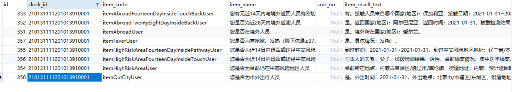
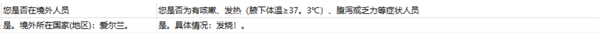

# 函数定义

 `MAX()`函数 **返回一组值中的最大值**。`MAX()`函数在许多查询中非常方便，例如查找最大数量，最昂贵的产品以及客户的最大付款。

语法如下：

```sql
MAX(expression);
```


## 特殊使用技巧

1、把一组数据的各项统计为一行数据



使用：

```
SELECT
	MAX(case when  t.item_code = 'itemAbroadFourteenDayInsideTouchBackUser' then t.item_result_text END ) AS '您有无近14天内与境外返回人员有密切接触',
	MAX(case when  t.item_code = 'itemAbroadUser' then t.item_result_text END ) AS '您是否在境外人员'
FROM
	xx表
```

 结果：



