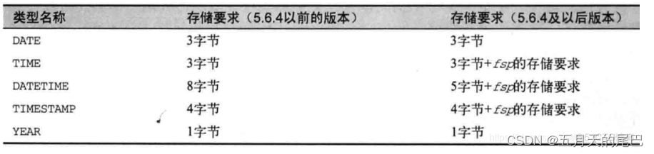

## 日期时间类型

| 类型      | 最小值              | 最大值                                              | 零值表示                     |
| --------- | ------------------- | --------------------------------------------------- | ---------------------------- |
| date      | 1000-01-01          | 9999-12-31                                          | 0000-00-00                   |
| datetime  | 1000-01-01 00:00:00 | 9999-12-31 23:59:59                                 | 0000-00-00 00:00:00[.000000] |
| time      | -838:59:59          | 838:59:59                                           | 00:00:00[.000000]            |
| timestamp | 19700101080001      | 2038-01-19 03:14:07.999999(准确的来讲应该是UTC范围) | 0000000000000000[000000]     |
| year      | 1901                | 2155                                                | 0000                         |

## 占用字节

## 注意事项

time、timestamp、datetime数据类型不指定精度时默认会四舍五入（大于500）
**解决方法：** 可以设置字段的精度，如timestamp(3)、timestamp(6)

show variables like 'log_%'; 

show master logs;

show binlog events IN 'mysql-bin.000053' \G;show variables like 'log_%'; 

show master logs;

show binlog events IN 'mysql-bin.000053' \G;

