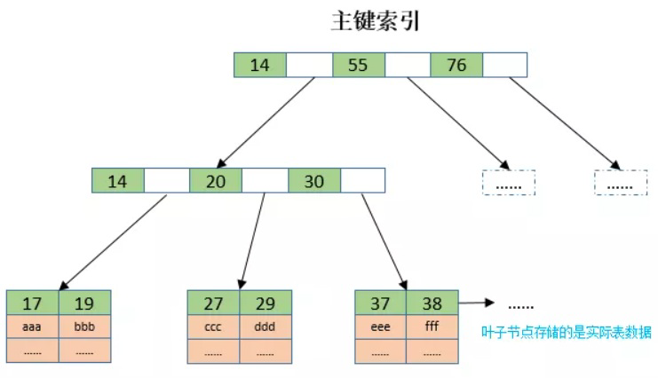
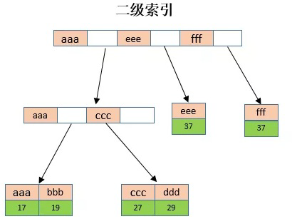

#### 死锁场景例子：

| 步骤 | 【事务1】洗车费用统计            | 【事务2】油料费统计             |
| ---- | -------------------------------- | ------------------------------- |
| 1    | 10 车牌A  11 车牌B               |                                 |
| 2    |                                  | 11 车牌B 10 车牌A               |
| 3    | 回表加锁主键—> 10                |                                 |
| 4    |                                  | 回表加锁主键 -> 11              |
| 5    | 10 车牌A  11 车牌B               |                                 |
| 6    |                                  | 11 车牌B 10 车牌A               |
| 7    | 回表加锁11 ，等待【事务2】释放11 |                                 |
| 8    |                                  | 回表加锁10，等待【事务1】释放10 |

**MySQL 的加锁机制**

##### （1）索引分类：

- 主键索引（或聚簇索引）

  主键索引和数据是存放在一起的，构成一棵 B+ 树，主键位于非叶子节点，数据存放于叶子节点。

  示意图如下：

  

  

- 二级索引（或非主键索引、非聚簇索引，包括各种主键索引外的其他索引）

  单独的文件，**二级索引列位于非叶子节点，**主键值位于叶子节点

  

##### （2）索引更新加锁逻辑

- 根据主键更新

  主键上加上互斥锁

- 根据唯一索引更新

  共两把锁，一把加在唯一索引上，一把加在主键索引上

- 根据非唯一索引更新

  同唯一索引，不同的是会给所有符合条件的索引加锁