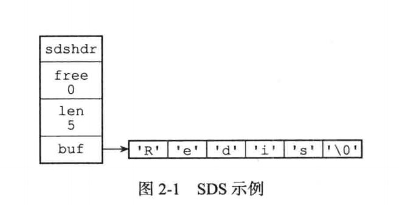
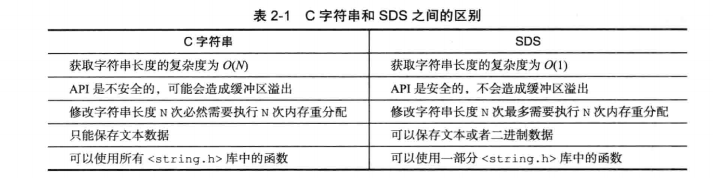
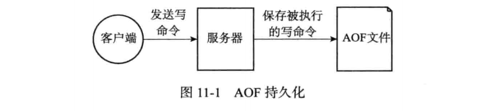
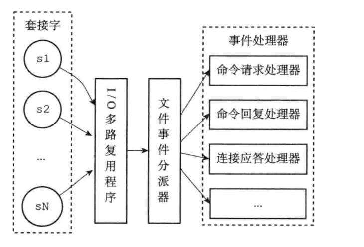
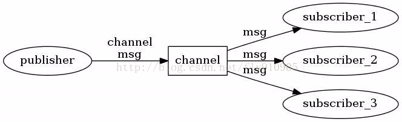

| 官网地址 | https://redis.io |
| -------- | ---------------- |
| 默认端口 | 6379             |


# redis 是什么？

    全称：Remote Dictionary Server（远程字典服务）是一个开源的使用ANSI C语言编写、
    支持网络、可基于内存亦可持久化的日志型、Key-Value 非关系型数据库，并提供多种语言的API。


# redis 的数据类型（对象）

**redis 数据并没有直接使用底层数据结构来实现，而是通过底层数据结构来创建对象系统。**

```
对象结构：
    struct redisObject{
        unsigned type; 		//类型
        unsigned encoding; 	//编码
        void *ptr; 			//指向底层实现数据结构的指针
    }
为什么这样设计？
   (1)、接口与实现分离，当需要增加或改变内部编码时，用户使用不受影响，
   (2)、可以根据不同的应用场景切换内部编码，提高效率。    
```

**对象系统包括：**

- 字符串对象
- 列表对象
- 哈希对象
- 无序集合对象
- 有序集合对象

每当在redis中创建一个（key, value），至少会创建两个对象，键对象和值对象。

**Redis对应的5种对象类型，而每种结构都有至少两种编码：** 

- String（字符串）

  ```
  二进制安全的，redis的String可以包含任何类型（如图片或者序列化对象），String类型是redis最基本的数据类型，一个键最大能存储512MB
  ** 注: 区分以下redis的String不同于java种String， 是一种新的数据结构。**
  ```

- Hash（哈希）

  ```
  是一个键值对(key:value)集合
  ```

- List（列表）

  ```
  简单的字符串列表，按照插入顺序排序
  ```

- Set（集合）

  ```
  是String类型的无序集合，不允许重复
  ```

- Zset（有序集合）

  ```
  扩展Set的有序
  ```


# redis 底层String实现数据结构

Redis虽然是C语言编写，但是它并没有使用C语言的传统字符串表示（以空字符结尾的字符数组），
而是自己构建了一种名为：

简单动态字符串（simple dynamic String， 简称SDS）

    SDS结构： 
    	struct SDS{
        	// 记录buf数组中已经使用的字节数量
            // 等于SDS所保留的字符串长度
            int len;
            
            // 记录buf数组中未使用的字节数量 
            int free;
                
            // 字节数组，用于保存字符串
            char buf[];
          }
          
    为什么这样设计？
    核心目的：二进制安全
            C语言的字符串，如果程序读到空字符会被误认为字符串结尾，这些限制导致C字符串只能保存文本数据，而不能
            存储图片等二进制数据。 SDS会使用自身结构中的len来判断结尾，而不会以空字符来判断是否结束。
举例： 命令redis> SET msg "redis" 



对比C语言字符串区别如下：




# redis 数据有效时间过期实现

- **结构** 

  维护一个expire字典（key， linux时间戳）

- **策略**

  **惰性删除**：每次获取value时都会检查是否过期，若过期就删除该value， 若没过期则返回该value； 

  **定期删除**：每隔一段时间，程序对数据库检查一次，删除过期的value;

  **注意：**定时周期太频繁占用CPU时间长，影响服务器响应时间和吞吐量。当以上策略都不能处理掉过期数据（**内存淘汰机制**）


# 为什么使用redis

## 1、服务稳定

### 宕机数据恢复（redis 数据持久化）

​	redis是内存数据库，当服务进程中断后，为了防止内存数据库中数据丢失，会保存到硬盘。

**【AOF】持久化方式**



​	**内容：**通过保存redis服务器执行的写命令来记录数据库状态

​	**执行方式：**

```
命令追加：当执行一个写命令之后，会以协议的格式被追加到aof_buf缓冲区末尾
文件写入/同步：将aof_buf缓冲区的数据保存到AOF文件中 ,然后在对AOF文件同步
```

​	**数据恢复：**

​	因AOF文件保存的是执行命令，所以还原数据的时候执行再执行一遍AOF就行

​	**问题：**

​	文件保存的是执行命令，随着时间推移，增加是非常快的，文件的体积会越来越大。如果不加以控制会占用redis资源	

```
>>> AOF重写优化 <<<
>>> 服务器资源，且AOF文件体积过大也会导致还原更慢，耗时更长。

重写方式：redis服务器会创建一个新的AOF文件来替换老的，新老文件还原的数据一致，但新文件去掉了一些冗余的命令减少空间的浪费。
```


**【RDB】持久化方式**


​	**内容：**将某个时间点的内存数据库保存到一个RDB文件。RDB文件是一个经过压缩的二进制文件，通过该文件可以还原当时的数据库状态。

​	**执行方式**：

```
手动执行或者根据配置定期执行，内存 -> RDB
SAVE：      该命令会阻塞Redis服务器进程，直到RDB文件生成完成，在阻塞期间服务器不能处理任何命令
BGSAVE：  fork派生一个子进程来生成RDB文件，服务器父进程会继续处理命令。问题占用内存2倍，可能导致内存不足
```

​	**数据恢复：** 无专门载入命令，由redis服务器启动的时候自动加载 

​	**问题：**
​	1、可能会造成数据丢失，当内存中的数据大小不足以触发备份，redis服务异常宕掉，就会发生数据丢失
​	2、SAVE 方式会阻塞redis,在阻塞期间服务器不能处理任何命令
​	3、BGSAVE fork子线程来生成RDB时，会将主内存的数据复制一份，内存空间翻倍，可能导致内存不足


### 尽量保证服务不宕机

redis服务采用集群部署

（1）主从模式

	版本2.8以后两种模式
	1、完整重同步：让主服务器创建和发送RDB文件，以及向从服务器发送保存在缓冲区里面的写命令来进行同步
	2、部分重同步：当服务器连接断开后， 主服务器向从服务器发送断开期间执行的写命令，从服务器接收并执行这些命令。将数据更新
	主服务器一样。   
	
	PSYNC(部分同步)结构 
	    1、主服务器的复制偏移量和从服务器的复制偏移量
	    2、主服务器的复制积压缓冲区
	    3、服务器运行的id
（2）主从+哨兵模式

（3）集群模式

​	数据分片（策略）

​	节点选举


## 2、性能高

### 单线程处理

- 避免多线程频繁切换线程上下文系统开销
- 基于文件时间的IO多路复用

### 直接操作内存数据

### redis 事件驱动数据结构

- **时间事件（imeEvent）**

  ```
  结构：
  	/* Time event structure - 时间事件结构体 */
  	typedef struct aeTimeEvent {
      	//时间事件id，累加增加，id降序链表
      	long long id; 
      	//时间秒数
      	long when_sec;
      	//时间毫秒
      	long when_ms;
      	//时间事件中的处理函数
      	aeTimeProc *timeProc;
      	//被删除的时候将会调用的方法
      	aeEventFinalizerProc *finalizerProc;
      	//客户端数据
      	void *clientData;
      	//时间结构体内的下一个结构体
      	struct aeTimeEvent *next;
  	} aeTimeEvent;
  	
  类型：
  	1、定时事件： 让程序在指定时间之后执行
      2、周期事件： 让程序每隔一段时间执行一次
  实现：
  	redis将所有时间事件都放在一个无序链表中，每当时间事件执行时，就会遍历整个链表，查询出所有已达时间的事件，并调用相应事件处理器处理。
  ```

- **文件事件（FileEvent）**

  

    结构：
    	/* File event structure - 文件事件结构体*/
    	typedef struct aeFileEvent {
        	//只为读事件或者写事件中的1种
        	int mask; /* one of AE_(READABLE|WRITABLE) */
        	//读事件方法, 根据不同任务关联不同的处理器,如应答、请求..
        	aeFileProc *rfileProc;
        	//写事件方法,根据不同任务关联不同的处理器,如写入..
        	aeFileProc *wfileProc;
        	//客户端数据,指向 redisClient 的指针
        	void *clientData;
    	} aeFileEvent;
  
    定义：基于reactor（反应器）模式开发自己的网络事件处理器
    内容：
    	1、采用I/O多路复用程序来同时监听多个套接字，并根据套接字当前要执行的任务来关联不同的事件处理器
        2、当被监听套接字准备好执行应答（accept）、读取（read）、写入（write）、关闭（close）等操作时，文件处理器就会调用
           之前关联好的处理器来执行事件       


# 使用场景

## 数据缓存

## 分布式锁

​	setNx + key 的过期时间。

​	使用lua 脚本保证原子性操作 ：

​	redis使用同一个lua脚本解释器，保证原子性执行lua脚本，不会同时执行其他脚本和命令。（当某个lua脚本执行慢时会影响redis性能）

## 消息发布与订阅

在redis中，你可以设定对某一个key值进行消息发布及消息订阅，当一个key值上进行了消息发布后，所有订阅它的客户端都会收到相应的消息。

**架构：**



发布者将消息发送到某个的频道，订阅了这个频道的订阅者就能接收到这条消息。

- publisher 发布者
- subscriber 订阅者
- channel  通道（相当于主题）


