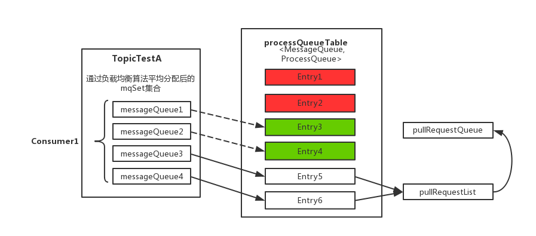

# 设计(design)

## 1 消息存储

### 1.1 消息存储结构

主要有三个文件构成：

- **CommitLog （消息主体以及元数据的存储主体）**

  存储Producer端写入的消息主体内容,消息内容不是定长的。单个文件大小默认1G, 文件名长度为20位，左边补零，剩余为起始偏移量，比如00000000000000000000代表了第一个文件，起始偏移量为0，文件大小为1G=1073741824；当第一个文件写满了，第二个文件为00000000001073741824，起始偏移量为1073741824，以此类推。消息主要是顺序写入日志文件，当文件满了，写入下一个文件

  【存储路径】：$HOME/store/commitlog/{fileName}

- **ConsumeQueue （消息消费队列）**

  引入的目的主要是提高消息消费的性能，由于RocketMQ是基于主题topic的订阅模式，消息消费是针对主题进行的，如果要遍历commitlog文件中根据topic检索消息是非常低效的。Consumer即可根据ConsumeQueue来查找待消费的消息。其中，ConsumeQueue（逻辑消费队列）作为消费消息的索引，保存了指定Topic下的队列消息在CommitLog中的起始物理偏移量offset，消息大小size和消息Tag的HashCode值。consumequeue文件可以看成是基于topic的commitlog索引文件，

  【存储路径】：$HOME/store/consumequeue/{topic}/{queueId}/{fileName}。（topic/queue/file三层组织结构）

  同样consumequeue文件采取定长设计，每一个条目共20个字节，分别为8字节的commitlog物理偏移量、4字节的消息长度、8字节tag hashcode，单个文件由30W个条目组成，可以像数组一样随机访问每一个条目，每个ConsumeQueue文件大小约5.72M

- **IndexFile（索引文件）**

  供了一种可以通过key或时间区间来查询消息的方法。

  【存储路径】：$HOME \store\index\${fileName}

  文件名fileName是以创建时的时间戳命名的，固定的单个IndexFile文件大小约为400M，一个IndexFile可以保存 2000W个索引，IndexFile的底层存储设计为在文件系统中实现HashMap结构，故rocketmq的索引文件其底层实现为hash索引。

### 1.2 消息刷盘

(1) **同步刷盘**：

​		只有在消息真正持久化至磁盘后RocketMQ的Broker端才会真正返回给Producer端一个成功的ACK响应。同步刷盘对MQ消息可靠性来说是一种不错的保障，但是性能上会有较大影响，一般适用于金融业务应用该模式较多。

(2) **异步刷盘**：

​		能够充分利用OS的PageCache的优势，只要消息写入PageCache即可将成功的ACK返回给Producer端。消息刷盘采用后台异步线程提交的方式进行，降低了读写延迟，提高了MQ的性能和吞吐量。

# 2 负载均衡

RocketMQ中的负载均衡都在Client端完成，具体来说的话，主要可以分为Producer端发送消息时候的负载均衡和Consumer端订阅消息的负载均衡。

## 2.1 Producer 负载均衡

Producer端在发送消息的时候，会先根据Topic找到指定的TopicPublishInfo，在获取了TopicPublishInfo路由信息后，RocketMQ的客户端在默认方式下selectOneMessageQueue()方法会从TopicPublishInfo中的messageQueueList中选择一个队列（MessageQueue）进行发送消息。具体的容错策略均在MQFaultStrategy这个类中定义。这里有一个sendLatencyFaultEnable开关变量，如果开启，在随机递增取模的基础上，再过滤掉not available的Broker代理。所谓的"latencyFaultTolerance"，是指对之前失败的，按一定的时间做退避。例如，如果上次请求的latency超过550Lms，就退避3000Lms；超过1000L，就退避60000L；如果关闭，采用随机递增取模的方式选择一个队列（MessageQueue）来发送消息，latencyFaultTolerance机制是实现消息发送高可用的核心关键所在。

## 2.2 consumer 负载均衡

在RocketMQ中，Consumer端的两种消费模式（Push/Pull）都是基于拉模式来获取消息的，而在Push模式只是对pull模式的一种封装，其本质实现为消息拉取线程在从服务器拉取到一批消息后，然后提交到消息消费线程池后，又“马不停蹄”的继续向服务器再次尝试拉取消息。如果未拉取到消息，则延迟一下又继续拉取。在两种基于拉模式的消费方式（Push/Pull）中，均需要Consumer端在知道从Broker端的哪一个消息队列—队列中去获取消息。因此，有必要在Consumer端来做负载均衡，即Broker端中多个MessageQueue分配给同一个ConsumerGroup中的哪些Consumer消费。

**1、Consumer端的心跳包发送**

在Consumer启动后，它就会通过定时任务不断地向RocketMQ集群中的所有Broker实例发送心跳包（其中包含了，消息消费分组名称、订阅关系集合、消息通信模式和客户端id的值等信息）。Broker端在收到Consumer的心跳消息后，会将它维护在ConsumerManager的本地缓存变量—consumerTable，同时并将封装后的客户端网络通道信息保存在本地缓存变量—channelInfoTable中，为之后做Consumer端的负载均衡提供可以依据的元数据信息。

**2、Consumer端实现负载均衡的核心类—RebalanceImpl**

在Consumer实例的启动流程中的启动MQClientInstance实例部分，会完成负载均衡服务线程—RebalanceService的启动（每隔20s执行一次）。通过查看源码可以发现，RebalanceService线程的run()方法最终调用的是RebalanceImpl类的rebalanceByTopic()方法，该方法是实现Consumer端负载均衡的核心。这里，rebalanceByTopic()方法会根据消费者通信类型为“广播模式”还是“集群模式”做不同的逻辑处理。这里主要来看下集群模式下的主要处理流程：

(1) 从rebalanceImpl实例的本地缓存变量—topicSubscribeInfoTable中，获取该Topic主题下的消息消费队列集合（mqSet）；

(2) 根据topic和consumerGroup为参数调用mQClientFactory.findConsumerIdList()方法向Broker端发送获取该消费组下消费者Id列表的RPC通信请求（Broker端基于前面Consumer端上报的心跳包数据而构建的consumerTable做出响应返回，业务请求码：GET_CONSUMER_LIST_BY_GROUP）；

(3) 先对Topic下的消息消费队列、消费者Id排序，然后用消息队列分配策略算法（默认为：消息队列的平均分配算法），计算出待拉取的消息队列。这里的平均分配算法，类似于分页的算法，将所有MessageQueue排好序类似于记录，将所有消费端Consumer排好序类似页数，并求出每一页需要包含的平均size和每个页面记录的范围range，最后遍历整个range而计算出当前Consumer端应该分配到的记录（这里即为：MessageQueue）。

(4) 然后，调用updateProcessQueueTableInRebalance()方法，具体的做法是，先将分配到的消息队列集合（mqSet）与processQueueTable做一个过滤比对。

- 上图中processQueueTable标注的红色部分，表示与分配到的消息队列集合mqSet互不包含。将这些队列设置Dropped属性为true，然后查看这些队列是否可以移除出processQueueTable缓存变量，这里具体执行removeUnnecessaryMessageQueue()方法，即每隔1s 查看是否可以获取当前消费处理队列的锁，拿到的话返回true。如果等待1s后，仍然拿不到当前消费处理队列的锁则返回false。如果返回true，则从processQueueTable缓存变量中移除对应的Entry；

- 上图中processQueueTable的绿色部分，表示与分配到的消息队列集合mqSet的交集。判断该ProcessQueue是否已经过期了，在Pull模式的不用管，如果是Push模式的，设置Dropped属性为true，并且调用removeUnnecessaryMessageQueue()方法，像上面一样尝试移除Entry；

最后，为过滤后的消息队列集合（mqSet）中的每个MessageQueue创建一个ProcessQueue对象并存入RebalanceImpl的processQueueTable队列中（其中调用RebalanceImpl实例的computePullFromWhere(MessageQueue mq)方法获取该MessageQueue对象的下一个进度消费值offset，随后填充至接下来要创建的pullRequest对象属性中），并创建拉取请求对象—pullRequest添加到拉取列表—pullRequestList中，最后执行dispatchPullRequest()方法，将Pull消息的请求对象PullRequest依次放入PullMessageService服务线程的阻塞队列pullRequestQueue中，待该服务线程取出后向Broker端发起Pull消息的请求。其中，可以重点对比下，RebalancePushImpl和RebalancePullImpl两个实现类的dispatchPullRequest()方法不同，RebalancePullImpl类里面的该方法为空，这样子也就回答了上一篇中最后的那道思考题了。

消息消费队列在同一消费组不同消费者之间的负载均衡，其核心设计理念是在一个消息消费队列在同一时间只允许被同一消费组内的一个消费者消费，一个消息消费者能同时消费多个消息队列。